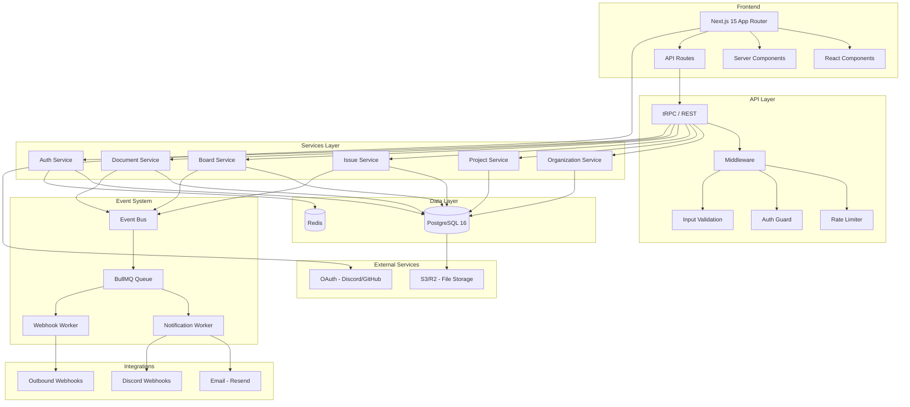
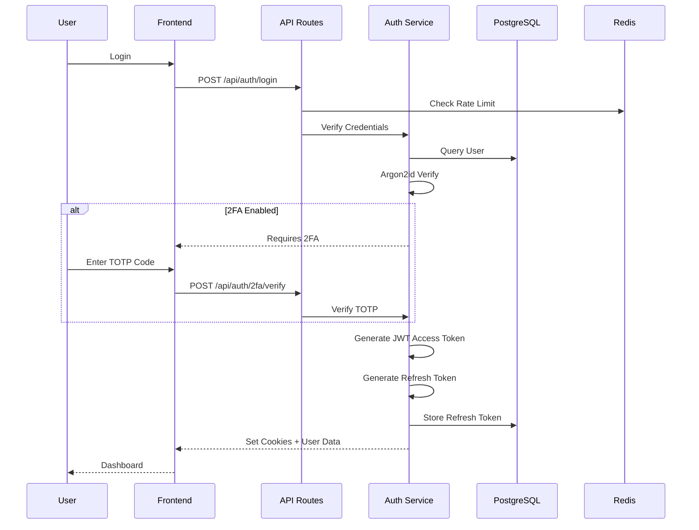
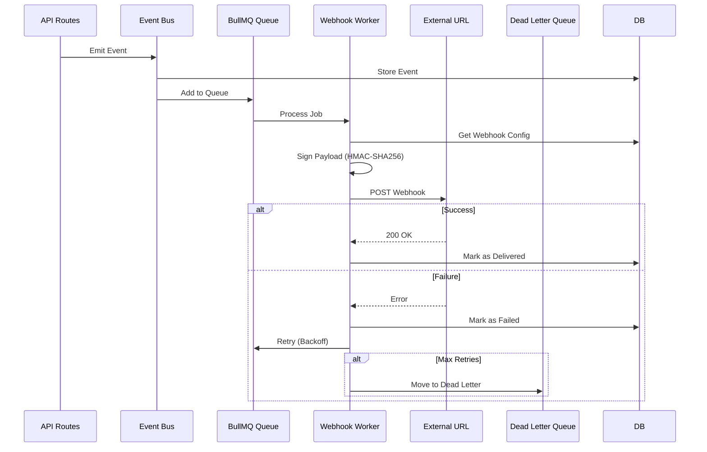
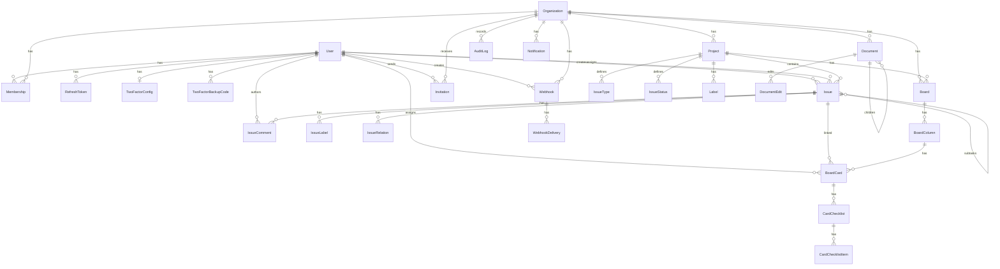
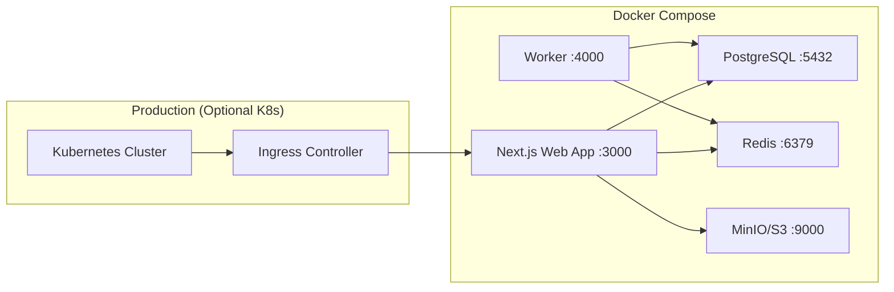

# ZenWork - Diagrama de Arquitectura

## Arquitectura General del Sistema

## Flujo de Autenticación

## Flujo de Webhooks Salientes

## Diagrama de Base de Datos (Entidades Principales)

## Despliegue Docker

