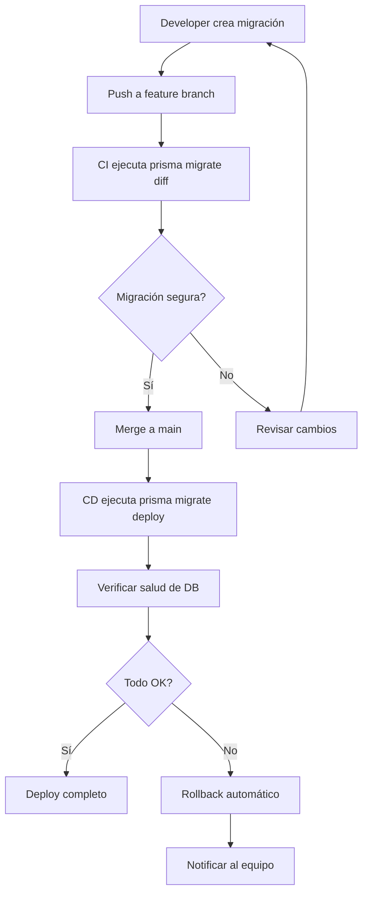

# ZenWork - Estrategia de Migraciones

## Principios Fundamentales

1. **Nunca romper datos existentes**: Todas las migraciones deben ser retrocompatibles
2. **Expand/Contract pattern**: Fase de expansión → migración de datos → fase de contracción
3. **IDs UUID**: Nunca usar autoincrementales expuestos
4. **Columnas nuevas**: Siempre NULLABLE o con DEFAULT
5. **Soft deletes**: Usar `deletedAt` en vez de DELETE físico

## Ejemplo: Expand/Contract - Agregar campo `estimatedHours` a Issues

### Fase 1: Expansión (Migración #1)

```sql
-- Migración: 20240101_add_estimated_hours_to_issues
-- Segura: columna nullable, no rompe nada

ALTER TABLE "issues" ADD COLUMN "estimated_hours" FLOAT;

-- Índice opcional si se va a filtrar frecuentemente
-- CREATE INDEX "issues_estimated_hours_idx" ON "issues"("estimated_hours");
```

### Fase 2: Migración de Datos (Script separado)

```sql
-- Script: migrate_story_points_to_estimated_hours.sql
-- Ejecutar DESPUÉS de desplegar la Fase 1

-- Migrar datos existentes de story_points a estimated_hours
UPDATE "issues"
SET "estimated_hours" = "story_points" * 2.5
WHERE "estimated_hours" IS NULL
  AND "story_points" IS NOT NULL;

-- Verificar que no hay datos huérfanos
SELECT COUNT(*) FROM "issues" WHERE "estimated_hours" IS NULL AND "story_points" IS NOT NULL;
```

### Fase 3: Contracción (Migración #2)

```sql
-- Migración: 20240115_remove_story_points_from_issues
-- SOLO ejecutar después de confirmar que la Fase 2 fue exitosa

-- 1. Verificar que no hay datos que dependan de story_points
DO $$
BEGIN
  IF EXISTS (SELECT 1 FROM "issues" WHERE "story_points" IS NOT NULL AND "estimated_hours" IS NULL) THEN
    RAISE EXCEPTION 'Aún hay issues sin migrar. Abortando.';
  END IF;
END $$;

-- 2. Eliminar la columna antigua
ALTER TABLE "issues" DROP COLUMN "story_points";
```

## Flujo de Migraciones en CI/CD



## Reglas de Migración

| Escenario | Estrategia | Ejemplo |
|---|---|---|
| Agregar columna | NULLABLE o con DEFAULT | `ALTER TABLE ADD COLUMN x TEXT DEFAULT ''` |
| Renombrar columna | Expand/Contract | Crear nueva → migrar datos → eliminar vieja |
| Eliminar columna | Soft delete primero | Marcar `deletedAt` → esperar → DROP |
| Agregar constraint | Validar datos primero | Verificar datos → ADD CONSTRAINT |
| Cambiar tipo | Expand/Contract | Crear nueva columna → migrar → eliminar vieja |
| Agregar índice | CONCURRENTLY | `CREATE INDEX CONCURRENTLY idx...` |

## Checklist antes de cada Migración

- [ ] ¿La migración es retrocompatible?
- [ ] ¿Las columnas nuevas son NULLABLE o tienen DEFAULT?
- [ ] ¿Se usa expand/contract si es necesario?
- [ ] ¿Los índices se crean CONCURRENTLY en producción?
- [ ] ¿Hay script de rollback?
- [ ] ¿Se probó en staging con datos de producción?
- [ ] ¿Los schemas de Prisma están actualizados?
